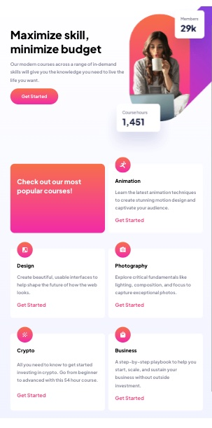
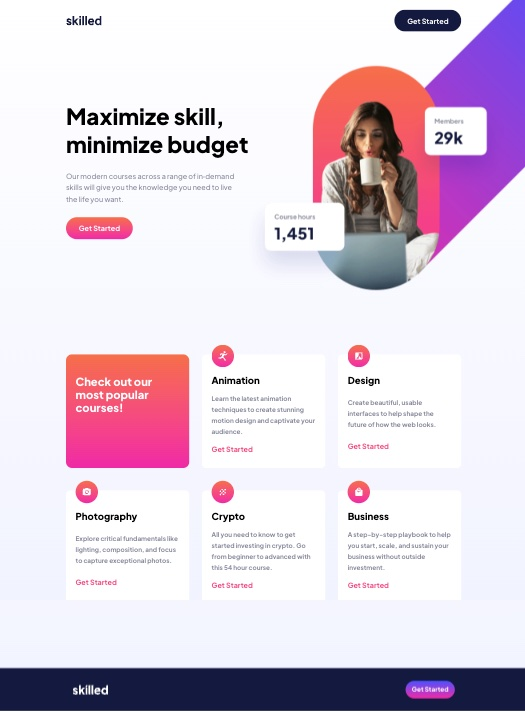

# Frontend Mentor - Skilled e-learning landing page solution

This is a solution to the [Skilled e-learning landing page challenge on Frontend Mentor](https://www.frontendmentor.io/challenges/skilled-elearning-landing-page-S1ObDrZ8q). Frontend Mentor challenges help you improve your coding skills by building realistic projects.

## Table of contents

- [Overview](#overview)
  - [The challenge](#the-challenge)
  - [Screenshot](#screenshot)
  - [Links](#links)
- [My process](#my-process)
  - [Built with](#built-with)
  - [What I learned](#what-i-learned)
- [Author](#author)

## Overview

### The challenge

Users should be able to:

- View the optimal layout depending on their device's screen size
- See hover states for interactive elements

### Screenshot

### Links

- Solution URL: [Challenge Solution](https://www.frontendmentor.io/challenges/skilled-elearning-landing-page-S1ObDrZ8q)
- Live Site URL: [My Solution](https://amazing-cendol-9d74be.netlify.app/)

## My process

### Built with

- CSS custom properties
- Flexbox
- CSS Grid
- Mobile-first workflow
- z-index
- Addtional breakpoints to maintain flow

### What I learned

I am progressing in regards to effeciency. This project took me roughly eight hours. My last project (podcast-landing paage) was completed in about seventeen. For this particular project, I was able to practice using postioning while applying z-index for the main desktop image. I was wondering why the header button was not able to show hover or active effects, and it turned out that the transparent part of the main image was overlapping. 

I also spent more time learning about the figma design and how to pull needed information. 

## Author

- Frontend Mentor - [@yourusername](https://www.frontendmentor.io/profile/wtwilliams310)
